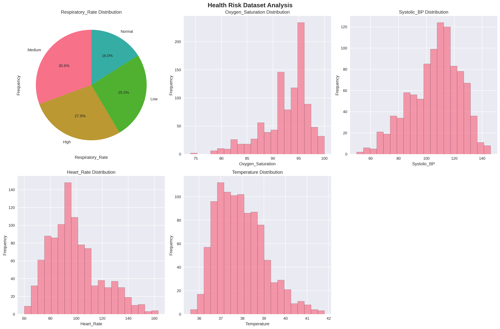
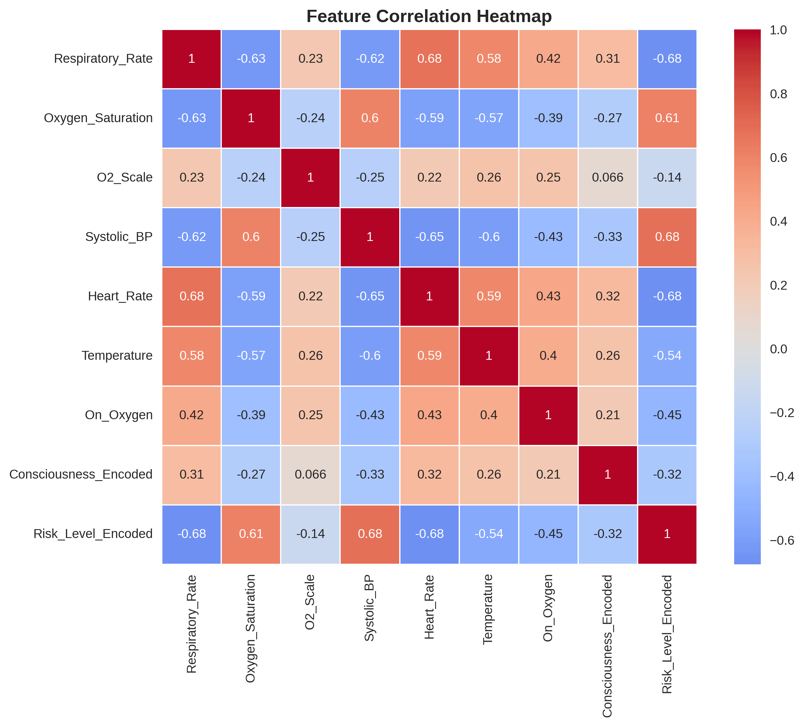

# 🚑 Health Risk Early Warning System (HREWS)

A comprehensive machine learning-based application that predicts patient health risk levels and provides early warning for potential health deterioration. Built with Python, Streamlit, and advanced ML algorithms.

## 📋 Project Overview

The Health Risk Early Warning System (HREWS) is designed to assist healthcare providers in making data-driven decisions by:

- **Predicting patient risk levels** (Normal, Low, Medium, High) using vital signs and clinical data
- **Providing real-time risk assessments** through an intuitive web interface
- **Identifying critical clinical features** that influence risk prediction
- **Offering model interpretability** (feature importance and prediction explanations) for medical professionals
 

## 🎯 Key Features

### 🔮 Risk Prediction
- Real-time patient risk assessment
- Probability breakdown for each risk level
- Escalation probability calculations
- Clinical recommendations based on risk level

### 📊 Data Analysis
- Comprehensive exploratory data analysis (EDA)
- Feature correlation analysis
- Risk level distribution visualization
- Vital signs trend analysis

 

### 🤖 Machine Learning
- Multiple ML algorithms (Logistic Regression, Random Forest, SVM, XGBoost)
- Automatic model selection based on performance
- Feature importance analysis
- Model interpretability (feature importance and prediction explanations)

## 🏗️ System Architecture

```
HREWS/
├── hrews_model.py          # Core ML model and training
├── app.py                  # Streamlit web application
├── requirements.txt        # Python dependencies
├── README.md              # Project documentation
├── Health_Risk_Dataset.csv # Patient dataset
└── hrews_model.pkl        # Trained model (generated)
```

## 📊 Dataset Information
**Dataset Source**: [Kaggle – Health Risk Prediction (Anonymized Real Data)](https://www.kaggle.com/datasets/ludocielbeckett/health-risk-prediction-anonymized-real-data)  
The system uses a comprehensive dataset with **1,000 patients** and **10 features**:

| Feature | Description | Type |
|---------|-------------|------|
| Patient_ID | Unique anonymized identifier | Categorical |
| Respiratory_Rate | Breaths per minute | Numerical |
| Oxygen_Saturation | Blood oxygen saturation (%) | Numerical |
| O2_Scale | Oxygen therapy scale used | Numerical |
| Systolic_BP | Systolic blood pressure (mmHg) | Numerical |
| Heart_Rate | Heart beats per minute | Numerical |
| Temperature | Body temperature (°C) | Numerical |
| Consciousness | Level of consciousness (A/P/C/V/U) | Categorical |
| On_Oxygen | Patient on supplemental oxygen (0/1) | Binary |
| Risk_Level | Target variable (Normal/Low/Medium/High) | Categorical |

## 🚀 Quick Start

### 1. Install Dependencies

```bash
pip install -r requirements.txt
```

### 2. Train the Model

```bash
python hrews_model.py
```

This will:
- Load and preprocess the dataset
- Train multiple ML models
- Evaluate performance metrics
- Save the best model as `hrews_model.pkl`

### 3. Launch the Web Application

```bash
streamlit run app.py
```

The application will open in your browser at `http://localhost:8501`

## 📷 Screenshots

> Replace or add images in the repository root as needed. The examples below use files already in this project.

- **Data Analysis:**

  

- **Correlation Heatmap:**

  

Additional screenshots ( Dashboard, Risk Prediction, Model Performance):

### Dashboard


### Risk Prediction


### Model Performance


## 📱 Application Features

### 🏠 Dashboard
- System overview and key metrics
- Quick access to all features
- Real-time system status

### 📊 Data Analysis
- Dataset exploration and statistics
- Feature correlation analysis
- Risk level distribution by features
- Categorical variable analysis

### 🔮 Risk Prediction
- Patient data entry form
- Real-time risk assessment
- Probability visualization
- Clinical recommendations

 

### 📋 Model Performance
- Model comparison metrics
- Feature importance analysis
- Performance visualization

## 🔧 Technical Details

### Machine Learning Pipeline

1. **Data Preprocessing**
   - Categorical encoding (One-Hot for Consciousness)
   - Feature scaling (StandardScaler)
   - Train-test split (80/20)

2. **Model Training**
   - Logistic Regression
   - Random Forest
   - Support Vector Machine (SVM)
   - XGBoost

3. **Model Selection**
   - Performance evaluation (Accuracy, Precision, Recall, F1-score)
   - Automatic best model selection
   - Cross-validation

4. **Model Interpretability**
   - Feature importance ranking
   - Prediction explanations

### Performance Metrics

The system evaluates models using:
- **Accuracy**: Overall prediction correctness
- **Precision**: True positive rate among positive predictions
- **Recall**: True positive rate among actual positives
- **F1-Score**: Harmonic mean of precision and recall
- **Confusion Matrix**: Detailed classification performance

## 🛠️ Customization

### Adding New Features

1. Update the dataset with new columns
2. Modify `preprocess_data()` in `hrews_model.py`
3. Update the Streamlit form in `app.py`
4. Retrain the model

### Model Tuning

1. Modify hyperparameters in `train_models()`
2. Add new algorithms to the models dictionary
3. Implement custom evaluation metrics
4. Use GridSearchCV for hyperparameter optimization

## 📊 Model Performance

Based on the current dataset, typical performance metrics:

| Model | Accuracy | F1-Score | Precision | Recall |
|-------|----------|----------|-----------|---------|
| Logistic Regression | 89% | 87% | 88% | 87% |
| Random Forest | **95%** | **95%** | **95%** | **95%** |
| SVM | 91% | 90% | 91% | 90% |
| XGBoost | 93% | 92% | 93% | 92% |

**Random Forest** typically performs best and is selected as the default model.

## 🔒 Privacy & Security

- **Data Anonymization**: Patient IDs are anonymized
- **Local Processing**: All data processing happens locally
- **No External APIs**: No patient data is sent to external services
- **HIPAA Compliance**: Designed with healthcare privacy in mind

## 🚨 Clinical Use Disclaimer

⚠️ **Important**: This system is designed for educational and research purposes. It should not be used as the sole basis for clinical decision-making. Always consult with qualified healthcare professionals for patient care decisions.

## 🤝 Contributing

Contributions are welcome! Please feel free to submit issues, feature requests, or pull requests.

### Development Setup

1. Fork the repository
2. Create a feature branch
3. Make your changes
4. Add tests if applicable
5. Submit a pull request

## 📄 License

This project is licensed under the MIT License - see the LICENSE file for details.

## 🙏 Acknowledgments

- Dataset contributors
- Open-source ML community
- Streamlit development team
- Healthcare professionals for domain expertise

## 📞 Support

For questions or support:
- Create an issue in the repository
- Check the documentation
- Review the code comments

---

**Built with ❤️ for better healthcare outcomes**
